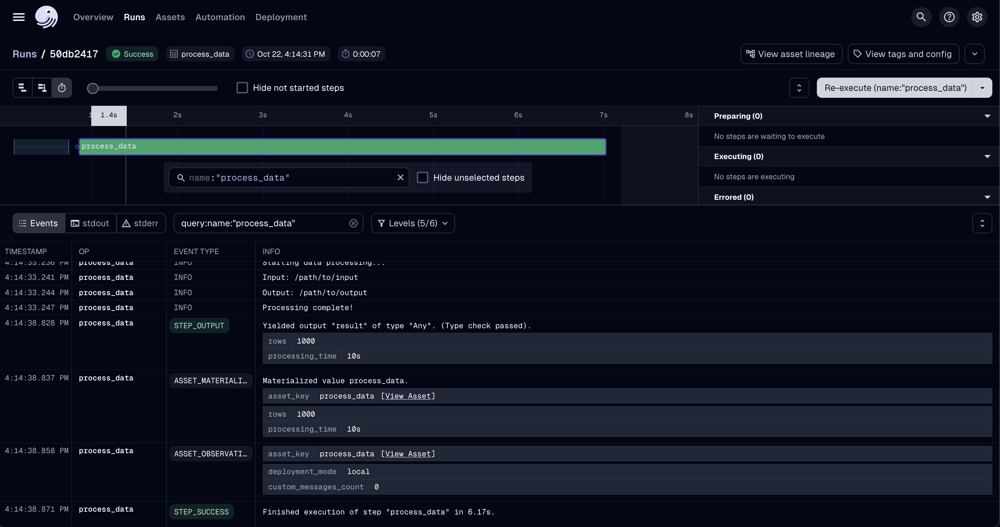

# dagster-slurm

[](https://pypi.python.org/pypi/dagster-slurm)
[](https://pypi.python.org/pypi/dagster-slurm)
[](https://pypi.python.org/pypi/dagster-slurm)
[](https://github.com/astral-sh/ruff)

---

Integration for running Dagster assets on Slurm HPC clusters.

`dagster-slurm` lets you take the same Dagster assets from a laptop to a Slurm-backed supercomputer with minimal configuration changes. This page walks through the demo environment bundled with the repository and highlights the key concepts you will reuse on your own cluster.

**An European sovereign GPU cloud does not come out of nowhere
maybe this project can support making HPC systems more accessible**.

See the [docs](https://ascii-supply-networks.github.io/dagster-slurm/) for instructions.

> **Status:** Local execution and one-job-per-asset Slurm runs are production-ready today. Session-based cluster reuse and heterogeneous jobs are actively being developed and will land in a future release.

## ✨ features

- **Unified API**: Same asset code works in dev (local) for rapid prototyping but just as well on a massive HPC system via SLURM.
- **Job launch**: One Slurm submission per Dagster asset keeps behaviour predictable. Operator-fusion/session reuse is on the roadmap (feedback welcome in [#22](https://github.com/ascii-supply-networks/dagster-slurm/issues/22)).
- **Pluggable Launchers**: Bash, Ray, Spark (WIP) - easy to add more
- **Environment Packaging**: Automatic `pixi`-based environment packaging for remote execution via `pixi-pack`
- **Connection Pooling**: SSH ControlMaster for efficient remote operations
- **Metrics Collection**: Automatic collection of Slurm job metrics (CPU efficiency, memory, node-hours)
- **Production-Prepared**: Proper error handling, cleanup, health checks

### 📊 Metrics 

Automatic metrics collection for all jobs: 

- Node-hours consumed
- CPU efficiency
- Max memory usage
- Elapsed time
     
Visible in Dagster UI metadata. 




### 🏗️ Architecture

#### Components

- Your server coordinating HPC and non HPC jobs
- The HPC compute resource


#### Layers of dagster-slurm

```
Asset Layer (user code)
  ↓
ComputeResource (facade)
  ↓
PipesClient (orchestration)
  ↓
Launcher (what to run) + SSH Pool (how to run)
  ↓
Slurm Execution
```

## Example

See [examples](./examples/) for a small tutorial which starts a slurm cluster in docker.
To use your own full-blown HPC deployment you would have to adapt the SSH connection configuration accordingly.
