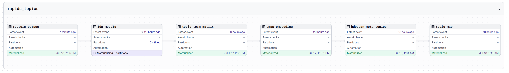
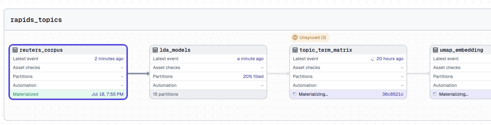
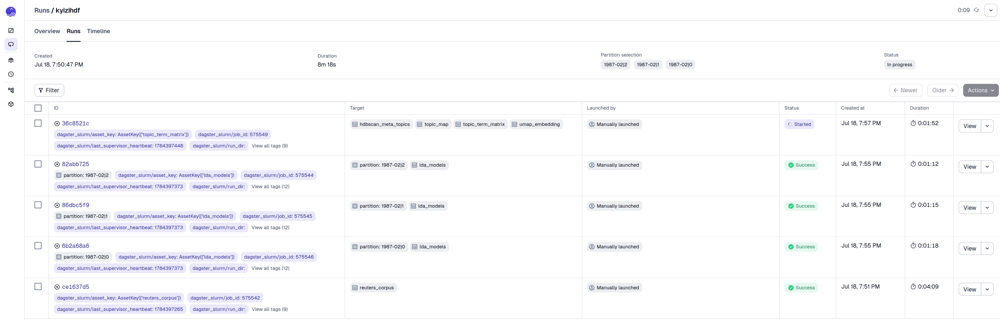
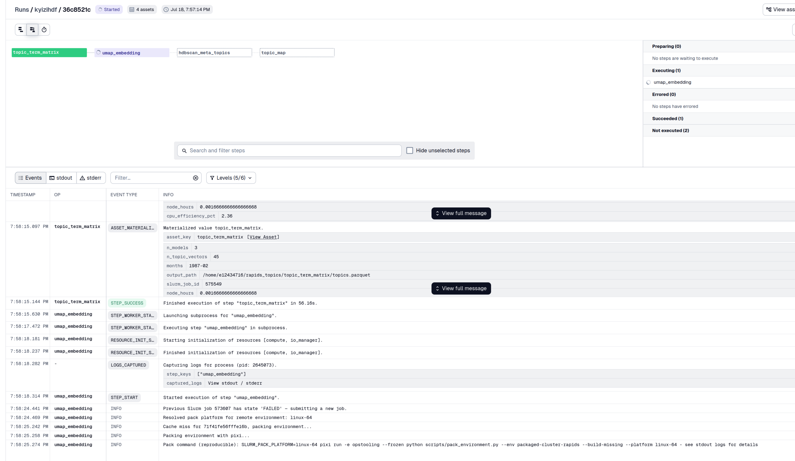
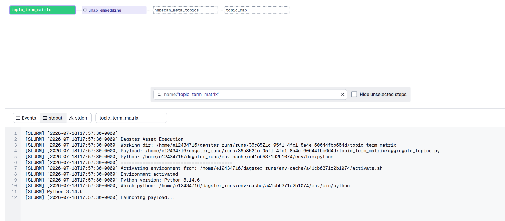
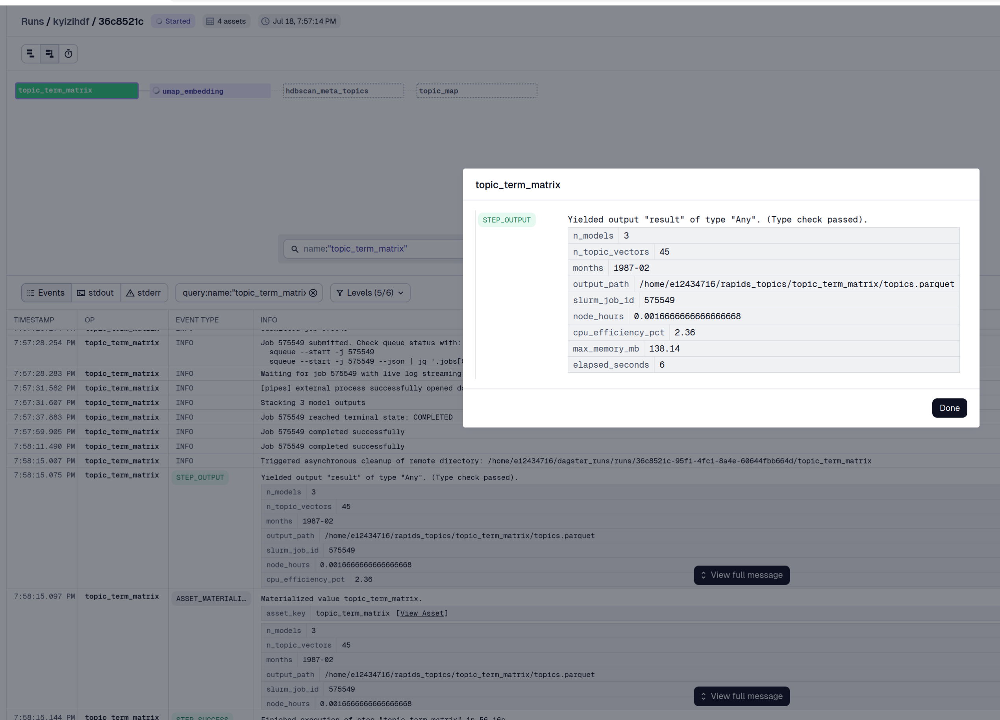
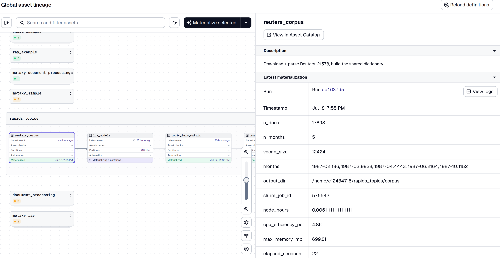
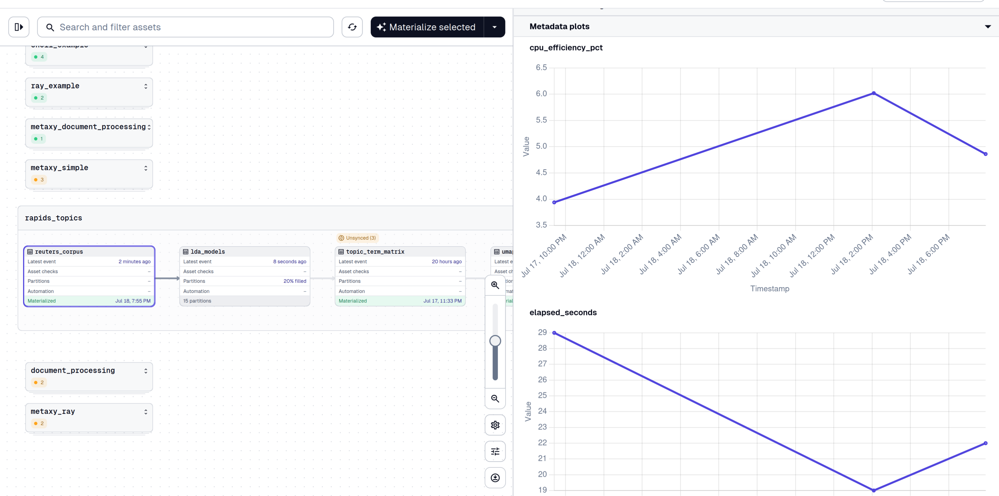

# GPU Topic Modeling with RAPIDS cuML

Train topic models on a Slurm HPC cluster and cluster them into meta-topics with
[RAPIDS cuML](https://docs.rapids.ai/api/cuml/stable/) UMAP and HDBSCAN, all
orchestrated from your laptop with dagster-slurm. This example is a small-scale,
public-data version of a production Common Crawl topic-modeling pipeline: a CPU
fan-out of gensim LDA jobs, followed by GPU dimensionality reduction and
clustering, followed by a labeled topic map streamed back into the Dagster UI.

The same asset code runs in three settings without modification:

- **local mode** on a laptop (no Slurm, no GPU),
- the **docker Slurm cluster** shipped with this repo (CPU fallback for the
  RAPIDS stages),
- a **real HPC cluster** with GPUs, where the UMAP and HDBSCAN stages run on
  cuML with `gpus_per_node: 1`.

:::info RAPIDS deployment gallery
This example fills two gaps in the
[RAPIDS deployment examples](https://docs.rapids.ai/deployment/stable/examples/):
none of the existing examples target HPC/Slurm, and none cover
topic-modeling/NLP clustering. See
[rapidsai/deployment#715](https://github.com/rapidsai/deployment/issues/715)
for the upstream contribution.
:::

## Overview

This application shows how to:

- Fan out partitioned model training as independent `sbatch` jobs (one Slurm
  job per partition) from a Dagster backfill
- Target **different packed environments per asset**: CPU stages run in a
  gensim environment, GPU stages in a self-contained RAPIDS environment
- Request GPUs per asset (`gpus_per_node: 1`) only on deployments that have
  them, with an automatic CPU fallback (umap-learn / hdbscan) elsewhere
- Ship Python environments to clusters **without container runtimes** using
  `pixi-pack`
- Stream Slurm job logs, structured metadata, and inline plots back into the
  Dagster UI over SSH
- Override Slurm sizing (CPUs, memory, wall time, GPU count) per run from the
  Dagster launchpad

What it deliberately does not show: GPU speedup benchmarks. The Reuters-21578
corpus is small; the point is the orchestration mechanics, which are identical
at production scale.

## Pipeline

Six assets in the `rapids_topics` group:

```
reuters_corpus            CPU sbatch   workload-topic-modeling env
    |                     download + SGML parse + shared gensim dictionary
    v
lda_models                CPU sbatch   one job per (month, seed) partition
    |                     5 months x 3 seeds = 15 independent Slurm jobs
    v
topic_term_matrix         CPU sbatch   stack topic-term vectors of all models
    |
    v
umap_embedding            GPU sbatch   packaged-cluster-rapids env
    |                     cuML UMAP (umap-learn fallback on CPU)
    v
hdbscan_meta_topics       GPU sbatch   cuML HDBSCAN (hdbscan fallback on CPU)
    |
    v
topic_map                 CPU sbatch   labeled meta-topic scatter + JSON summary
```



### Why cluster topic-term vectors?

Doc-topic vectors from independently trained LDA models are not comparable:
topic 7 in the February model has nothing to do with topic 7 in the March
model. The chain therefore clusters **topic-term vectors** (rows of
`get_topics()` over a dictionary shared by all models) into meta-topics. Every
topic from every `(month, seed)` model becomes one point in vocabulary space;
UMAP reduces those points to 2D and HDBSCAN groups recurring themes across
months and seeds into meta-topics. This is the same construction as the
production aggregation stage over bootstrap models.

### Dataset

[Reuters-21578](https://kdd.ics.uci.edu/databases/reuters21578/reuters21578.html),
the classic 1987 newswire research corpus (~21k documents, ~18k with usable
body text). It is small, quick to download, and dated, which preserves the
temporal partitioning story of the production pipeline: the corpus asset
buckets documents by month, and LDA training fans out over
`(month, seed)`.

## Files

| Piece               | Path                                                                                                                      |
| ------------------- | ------------------------------------------------------------------------------------------------------------------------- |
| Asset definitions   | `examples/projects/dagster-slurm-example/dagster_slurm_example/defs/rapids_topics/topic_assets.py`                        |
| Corpus payload      | `examples/projects/dagster-slurm-example-hpc-workload/dagster_slurm_example_hpc_workload/rapids_topics/prepare_corpus.py` |
| LDA payload         | `.../rapids_topics/lda_train.py`                                                                                          |
| Aggregation payload | `.../rapids_topics/aggregate_topics.py`                                                                                   |
| UMAP payload        | `.../rapids_topics/umap_reduce.py`                                                                                        |
| HDBSCAN payload     | `.../rapids_topics/hdbscan_cluster.py`                                                                                    |
| Report payload      | `.../rapids_topics/topic_map.py`                                                                                          |

As in every dagster-slurm example, the *assets* only orchestrate: they pick a
payload, an environment, and Slurm resources. The *payloads* are plain Python
scripts that communicate with Dagster through
[Pipes](https://docs.dagster.io/guides/build/external-pipelines) and can also
run standalone.

## Environments: one per stage

The pipeline uses two packed pixi environments, declared per asset via
`slurm_pack_cmd` metadata:

- **`workload-topic-modeling`**: the standard cluster stack plus gensim. Used
  by the CPU stages (corpus, LDA, aggregation).
- **`packaged-cluster-rapids`**: a self-contained environment (Python 3.12,
  `numpy<2.3`) with `cuml` from the `rapidsai` conda channel on linux-64, and
  the CPU fallback libraries (umap-learn, hdbscan, matplotlib) co-installed.
  Used by the UMAP, HDBSCAN, and report stages on every deployment, CPU
  fallback included.

```toml
# examples/pyproject.toml (excerpt)
[tool.pixi.feature.cluster-rapids]
channels = [{ channel = "rapidsai", priority = 1 }]

[tool.pixi.feature.cluster-rapids.dependencies]
python = "3.12.*"
numpy = ">=2.0,<2.3"
umap-learn = ">=0.5,<1"
hdbscan = ">=0.8,<1"
matplotlib = ">=3.9,<4"

[tool.pixi.feature.cluster-rapids.target.linux-64.dependencies]
cuml = ">=25.10,<26"
```

Why a separate solve-group instead of adding cuML to the main cluster
environment? RAPIDS pins numba, and numba pins numpy below what the rest of
the cluster stack wants. Co-locating umap-learn with the main stack makes the
resolver backtrack into unbuildable sdists. Giving RAPIDS its own solve-group
keeps both environments installable, and dagster-slurm makes running each
asset in its own environment a one-line metadata declaration:

```python
_RAPIDS_PACK_METADATA = {
    "slurm_pack_cmd": [
        "pixi", "run", "-e", "opstooling", "--frozen",
        "python", "scripts/pack_environment.py",
        "--env", "packaged-cluster-rapids", "--build-missing",
    ],
}

@dg.asset(group_name="rapids_topics", metadata=_RAPIDS_PACK_METADATA, ...)
def umap_embedding(...): ...
```

The environment is packed with `pixi-pack` into a single self-extracting
archive, shipped to the cluster over SSH, and cached by content hash. No
container runtime is needed on the cluster, which is the common case on HPC
sites. See [Environment packaging](../how-to/environment-packaging.md) for the
mechanism.

## GPU on the cluster, CPU everywhere else

The payloads select their backend at import time. If cuML imports, the GPU
implementation is used; otherwise the CPU library. One payload serves both the
docker Slurm cluster and a GPU node:

```python
# umap_reduce.py (excerpt)
try:
    import cuml
    cuml.set_global_output_type("numpy")
    _HAS_CUML = True
except ImportError:
    _HAS_CUML = False


def make_umap(*, n_components, n_neighbors, min_dist, metric,
              random_state, build_algo):
    if _HAS_CUML:
        from cuml.manifold import UMAP as _UMAP
        return _UMAP(
            n_components=n_components, n_neighbors=n_neighbors,
            min_dist=min_dist, metric=metric,
            random_state=random_state, build_algo=build_algo,
            verbose=True,
        )
    from umap import UMAP as _UMAP
    return _UMAP(
        n_components=n_components, n_neighbors=n_neighbors,
        min_dist=min_dist, metric=metric,
        random_state=random_state, low_memory=True, verbose=True,
    )
```

The matching asset requests a GPU only when the deployment is a real
supercomputer:

```python
def _gpu_slurm_opts() -> dict:
    if _is_supercomputer():
        return {"nodes": 1, "cpus_per_task": 8, "mem": "32G",
                "gpus_per_node": 1}
    return {"nodes": 1, "cpus_per_task": 2, "mem": "4G",
            "gpus_per_node": 0}
```

Each materialization reports which backend actually ran (`backend: cuml (GPU)`
or `backend: umap-learn (CPU)`) in its asset metadata, so a
misconfigured deployment is visible in the UI rather than silent.

### Practical notes on cuML on HPC

Hard-won details baked into the example, worth knowing before you adapt it:

- **`cuml.set_global_output_type("numpy")`** keeps the rest of the payload
  backend-agnostic: downstream code sees numpy arrays whether cuML or the CPU
  library produced them.
- **UMAP `build_algo` stays on `"auto"`.** cuML picks brute-force kNN for
  small inputs and GPU nn-descent at scale. Forcing `nn_descent` on a small
  input (fewer than ~150 rows) crashes cuML with a CUDA invalid-argument
  error. Only set it explicitly for genuinely large corpora.
- **cuML HDBSCAN caps `min_samples` at 1023.** The payload clamps the value on
  the GPU branch only.
- **cuML HDBSCAN labels more points as noise** than the CPU library at
  identical settings. Tune `min_cluster_size` / `min_samples` against your
  real data, not against the CPU fallback.
- **cuML is linux-64 only** in this setup, declared under
  `[tool.pixi.feature.cluster-rapids.target.linux-64.dependencies]`, so the
  same pixi environment still solves on a macOS laptop (CPU libraries only).

## Usage

### 1. Local mode (laptop, no Slurm)

```bash
cd examples
pixi run start
# open http://localhost:3000, materialize assets in the rapids_topics group
```

The CPU stages (corpus, LDA partitions, aggregation) materialize directly on
your machine. The RAPIDS stages need a Slurm deployment with the rapids
environment: the dev environment deliberately excludes umap-learn/hdbscan
because of the numba/numpy pin conflict described above.

### 2. Docker Slurm cluster (full chain, CPU fallback)

Start the three-container Slurm cluster and run in staging mode, where
environments are packed and deployed on demand:

```bash
docker compose up -d          # repo root: slurmctld + compute nodes
cd examples
pixi run start-staging
```

Materialize the whole `rapids_topics` group. Every asset becomes an `sbatch`
job inside the docker cluster; the UMAP/HDBSCAN payloads log
`backend: umap-learn (CPU)` and produce the same artifact shapes as the GPU
path. This is also what CI exercises.

### 3. Real HPC cluster with GPUs

Point dagster-slurm at your cluster and start in supercomputer mode:

```bash
export SLURM_EDGE_NODE_HOST=login.your-cluster.example
export SLURM_EDGE_NODE_USER=your-user
export SLURM_EDGE_NODE_KEY_PATH=~/.ssh/id_ed25519

cd examples
pixi run start-staging-supercomputer      # pack + deploy envs on demand
# or, with pre-deployed environments:
pixi run start-production-supercomputer
```

In supercomputer deployments the GPU assets submit with `gpus_per_node: 1`
and the payloads log `backend: cuml (GPU)`.

Optional environment variables:

| Variable                | Effect                                                               |
| ----------------------- | -------------------------------------------------------------------- |
| `RAPIDS_TOPICS_BASE`    | Base output directory on the cluster (default `$HOME/rapids_topics`) |
| `RAPIDS_TOPICS_CPU_ENV` | Path to an already-extracted CPU env on the cluster; skips packing   |
| `RAPIDS_TOPICS_GPU_ENV` | Same, for the rapids environment                                     |

Packing the rapids environment takes a while the first time (cuML is large).
For iterating on a real cluster, extract it once and set
`RAPIDS_TOPICS_GPU_ENV`, or use the launchpad override described below.

### Per-run overrides from the launchpad

All six assets share a config schema (`TopicSlurmConfig`) whose fields default
to "use the deployment-aware defaults". From the Dagster launchpad you can
override `cpus_per_task`, `mem`, `time_limit`, `gpus_per_node`, and
`pre_deployed_env_path` for a single run without touching code, plus the
modeling knobs (topic count, UMAP neighbors, HDBSCAN cluster sizes) each stage
exposes.

## What you see in the UI

The screenshots below are from a run against a real Slurm cluster (staging
supercomputer mode, one A100 for the GPU stages).

**Partitioned fan-out.** `lda_models` is partitioned by `(month, seed)`; a
backfill dispatches each partition as its own `sbatch` job. The lineage view
shows the fan-out filling up while downstream assets wait:



**One Slurm job per run.** The backfill's run list tags every run with its
Slurm job id (`dagster_slurm/job_id`), so you can correlate Dagster runs with
`sacct`/`squeue` output directly:



**Live event log, including environment packing.** The event log shows the
full lifecycle: cache miss on the environment hash, the reproducible
`pixi-pack` command, job submission, and live log streaming over SSH:



**Raw Slurm stdout, streamed.** The `stdout` tab shows exactly what ran on
the compute node: working directory, payload path, which Python the packed
environment resolved to:



**Structured results per stage.** Every payload reports metadata through
Pipes: row counts, output paths, the Slurm job id, plus scheduler-derived
efficiency numbers (`node_hours`, `cpu_efficiency_pct`, `max_memory_mb`):



The corpus asset does the same at the head of the pipeline (document counts
per month, dictionary size, output directory):



**Metrics over time.** Because efficiency numbers are numeric metadata,
Dagster plots them across materializations for free. Cost regressions in a
pipeline stage show up as a line going the wrong way:



The terminal `topic_map` asset emits the labeled meta-topic scatter plot as
inline metadata, so the topic map itself renders in the asset view.

## Refined example: incremental reprocessing with metaxy

The basic pipeline recomputes everything downstream of a change: re-train one
month's LDA models and the aggregation, UMAP, and HDBSCAN stages all run
again over the full topic set. At toy scale that is fine. In production, where
the fan-out is hundreds of partitions and model retrains arrive continuously,
you want to know *which topic vectors actually changed* and skip the rest.

[metaxy](https://github.com/ascii-supply-networks/metaxy) adds sample-level
incremental tracking on top of the same pipeline. This repo already ships two
working metaxy integrations (the `metaxy_simple` and `metaxy_ray` asset
groups); the refinement below applies the identical pattern to the topic
chain.

### Feature specs

Each topic-term vector is a tracked sample, keyed by a stable id. Meta-topic
assignments depend on them:

```python
# shared feature definitions, importable by assets and payloads
import metaxy as mx

class TopicTermVectors(
    mx.BaseFeature,
    spec=mx.FeatureSpec(
        key="rapids_topics/topic_term_vectors",
        id_columns=["topic_uid"],          # e.g. "1987-02/seed=1/topic=7"
        fields=["month", "seed", "topic_id", "vector"],
    ),
):
    topic_uid: str
    month: str
    seed: int
    topic_id: int
    vector: list[float]


class MetaTopics(
    mx.BaseFeature,
    spec=mx.FeatureSpec(
        key="rapids_topics/meta_topics",
        id_columns=["topic_uid"],
        fields=["embedding", "cluster"],
        deps=[TopicTermVectors],
    ),
):
    topic_uid: str
    embedding: list[float]
    cluster: int
```

### Asset side

The aggregation asset registers vectors in the store instead of only writing a
parquet file. The store is selected per deployment in `metaxy.toml` (DuckDB
locally, a Delta table on the shared cluster filesystem in production), and
the config file ships to the cluster with the payload via `extra_files`:

```python
import metaxy.ext.dagster as mxd

@mxd.metaxify
@dg.asset(
    metadata={"metaxy/feature": "rapids_topics/topic_term_vectors",
              **_CPU_PACK_METADATA},
    group_name="rapids_topics_metaxy",
    deps=[lda_models],
)
def topic_term_matrix(context, compute: ComputeResource, config: TopicSlurmConfig):
    metaxy_config = dg.file_relative_path(__file__, "../../../../../metaxy.toml")
    return compute.run(
        context=context,
        payload_path=_payload("aggregate_topics_metaxy.py"),
        config=config,
        extra_files=[metaxy_config],
        extra_env={"METAXY_STORE": _store_for_deployment(), **_base_env()},
        extra_slurm_opts=_merged_slurm_opts(_cpu_slurm_opts(), config),
    ).get_results()
```

### Payload side

Inside the Slurm job, the payload asks the store what changed and processes
only that increment:

```python
# aggregate_topics_metaxy.py (core of the payload)
import metaxy as mx

cfg = mx.init()                     # reads the shipped metaxy.toml
store = cfg.get_store()

with store:
    increment = store.resolve_update("rapids_topics/topic_term_vectors",
                                     samples=stacked_vectors)

to_write = increment.new.to_polars()
stale = increment.stale.to_polars()   # vectors whose upstream model changed
context.log.info(f"{len(to_write)} new + {len(stale)} stale topic vectors")

with store.open(mode="w"):
    if len(to_write) > 0:
        store.write("rapids_topics/topic_term_vectors", to_write)
    if len(stale) > 0:
        store.write("rapids_topics/topic_term_vectors", stale)
```

The UMAP/HDBSCAN payload then resolves the increment for
`rapids_topics/meta_topics`. If the increment is empty, it reports
`status: up_to_date` and exits without touching the GPU, which on a busy
cluster means the job releases its allocation in seconds.

### What this buys you, honestly

UMAP and HDBSCAN are global models: when the topic set does change, the
reduction and clustering rerun over the full set, because a partial re-embed
is not meaningful. The incremental win for the GPU stages is therefore
**change detection** (skip the whole GPU job when nothing upstream changed,
for example after a partial backfill retry) and **provenance** (every
meta-topic assignment is traceable to the exact model version that produced
its topic vector). For the fan-in stage the win is the classic one: only
new or stale vectors are re-registered.

Re-materializing a single month's `lda_models` partitions now results in:

1. `topic_term_matrix` registers only that month's ~45 vectors as stale;
   everything else is untouched.
2. `umap_embedding` sees a non-empty increment and reruns (global model).
3. A second materialization with no upstream changes reports
   `status: up_to_date` at every stage and submits no compute-heavy work.

For a complete, runnable reference of the store setup (DuckDB vs Delta per
deployment), `@metaxify` wiring, and `MetaxyDatasource`/`MetaxyDatasink`
inside distributed payloads, see the `metaxy_simple` and `metaxy_ray` groups
in `examples/projects/dagster-slurm-example/dagster_slurm_example/defs/` and
the corresponding payloads under
`dagster_slurm_example_hpc_workload/ray/`.

## Next steps

- **Environment packaging**: how packed environments are built, cached, and
  deployed in [Environment packaging](../how-to/environment-packaging.md)
- **Execution modes**: local vs docker vs supercomputer deployments in
  [Execution modes](../how-to/execution-modes.md)
- **Docling application**: the same per-asset environment pattern applied to
  document processing in
  [Document Preprocessing with Docling](./document-preprocessing-docling.md)
- **Upstream**: the RAPIDS deployment gallery contribution is tracked in
  [rapidsai/deployment#715](https://github.com/rapidsai/deployment/issues/715)

## Source code

- **Assets**: `examples/projects/dagster-slurm-example/dagster_slurm_example/defs/rapids_topics/`
- **Payloads**: `examples/projects/dagster-slurm-example-hpc-workload/dagster_slurm_example_hpc_workload/rapids_topics/`
- **Environments**: `examples/pyproject.toml` (`workload-topic-modeling`, `packaged-cluster-rapids`)
- **Pull request**: [ascii-supply-networks/dagster-slurm#153](https://github.com/ascii-supply-networks/dagster-slurm/pull/153)
