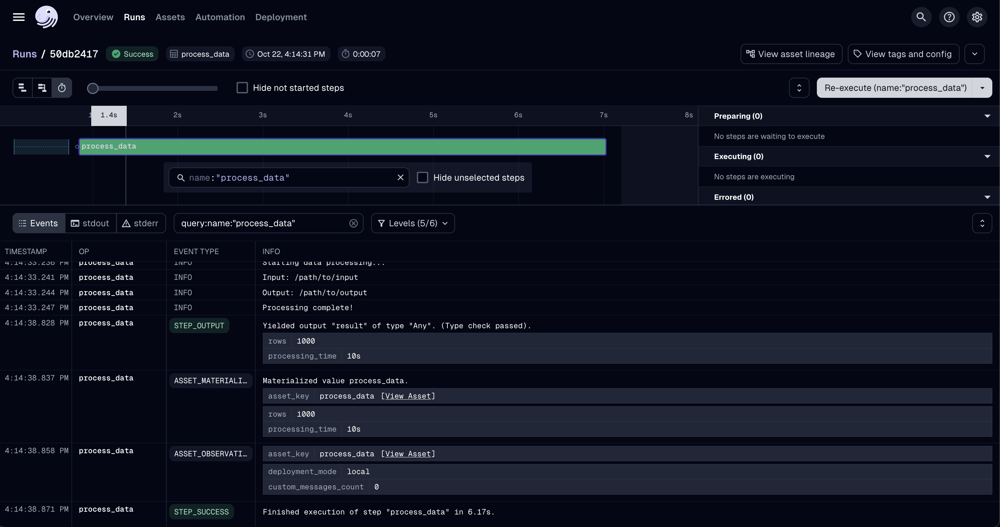
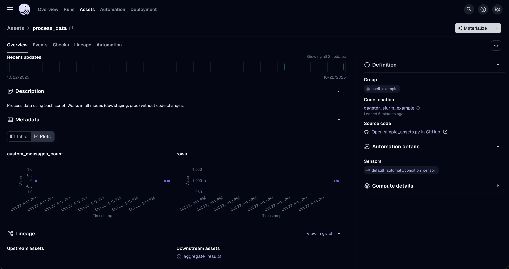

# Getting started

`dagster-slurm` lets you take the same Dagster assets from a laptop to a Slurm-backed supercomputer with minimal configuration changes. This page walks through the demo environment bundled with the repository and highlights the key concepts you will reuse on your own cluster.

**A European sovereign GPU cloud does not come out of nowhere.
Maybe this project can support making HPC systems more accessible.**


## What Dagster-Slurm technically delivers

- **Deterministic runtimes:** `pixi` and `pixi-pack` freeze your dependencies, upload the bundle to the HPC edge, and install exactly once per version.
- **Automated deployment:** Dagster assembles the run directory, syncs it to the cluster, and invokes Slurm without custom shell scripts.
- **Structured telemetry:** Slurm job IDs, queue states, CPU/memory usage, and Ray logs stream back through Dagster Pipes so you keep a single source of truth.

## Developer experience benefits

- **Config-only mobility:** Toggle `DAGSTER_DEPLOYMENT` to jump between local execution, staging Slurm, and production supercomputers—no code forks.
- **Unified observability:** Dagster’s UI surfaces HPC and non-HPC runs side by side, with log tailing, run metadata, and asset lineage in one place.
- **Operational confidence:** Jobs inherit retries, alerts, and run status checks from Dagster, while structured metrics simplify post-mortems.

## Prerequisites

- [pixi](https://pixi.sh/latest/installation/) (`curl -fsSL https://pixi.sh/install.sh | sh`)
- `pixi global install git`
- Docker (or compatible runtime) with the `docker compose` plugin available

## Fetch the repository

```bash
git clone https://github.com/ascii-supply-networks/dagster-slurm.git
cd dagster-slurm
docker compose up
cd examples
```

The Docker compose stack starts a local Dagster control plane, a Slurm edge node, and a compute partition to mirror a typical HPC setup.

## 1. Develop locally (no Slurm)

For rapid iteration, execute assets directly on your workstation:

```bash
pixi run start
```

Navigate to [http://localhost:3000](http://localhost:3000) to view the Dagster UI with assets running in-process.


## 2. Using Dagster

To understand the benefits of using **Dagster** with **Slurm**, open the **Dagster UI** and navigate to the **Assets** tab.
Here, you’ll see the different assets that can be *materialized* (i.e., executed).

For this example, select the asset **`process_data`**, which is a dummy asset that doesn’t actually process any data.
Once it’s materialized, go to the **Runs** tab and open the newly created run.

In the **Run view**, you can explore detailed output and run information (see screenshot below).
For example, you can check the input path, output logs, number of processed rows, and total processing time.



Under the **`stderr`** and **`stdout`** tabs, Dagster automatically collects the respective logs.
This feature is especially useful when working with **Slurm**, where you would otherwise need to manually log into the compute machine to locate the individual output files.
With Dagster, all logs are centralized, making them easy to access, compare, and troubleshoot.

To further explore your asset runs, return to the Assets tab and select process_data again.
Here, you can review all past runs of that asset, compare their performance, and analyze trends across executions (see screenshot below).
Depending on your Dagster configuration, you can also log and visualize additional metrics or properties.





## 3. Point to your own HPC cluster

1. Update the SSH and Slurm configuration in
   [`examples/projects/dagster-slurm-example/dagster_slurm_example/resources/__init__.py`](https://github.com/ascii-supply-networks/dagster-slurm/blob/main/examples/projects/dagster-slurm-example/dagster_slurm_example/resources/__init__.py)
   (or your own equivalent module).
2. Provide the connection details via environment variables—`dagster-slurm` reads them at runtime so you can keep secrets out of the repository.

**Required environment variables**

| Variable | Purpose | Notes |
| --- | --- | --- |
| `SLURM_EDGE_NODE_HOST` | SSH hostname of the login/edge node. | - |
| `SLURM_EDGE_NODE_PORT` | SSH port. | Defaults to `22` on most clusters. |
| `SLURM_EDGE_NODE_USER` | Username used for SSH and job submission. | Often tied to an LDAP or project account. |
| `SLURM_EDGE_NODE_PASSWORD` / `SLURM_EDGE_NODE_KEY_PATH` | Authentication method. | Prefer key-based auth; set whichever your site supports. |
| `SLURM_EDGE_NODE_FORCE_TTY` (optional) | Request a pseudo-terminal (`-tt`). | Set to `true` on clusters that insist on interactive sessions. Leave `false` when using a jump host. |
| `SLURM_EDGE_NODE_POST_LOGIN_COMMAND` (optional) | Command prefix run immediately after login. | Supports `{cmd}` placeholder; useful when you cannot use `ProxyJump`. |
| `SLURM_EDGE_NODE_JUMP_HOST` / `_USER` / `_PORT` / `_PASSWORD` (optional) | Configure an SSH jump host (uses `ssh -J`). | Lets you hop via `vmos`/bastion nodes; password-based auth is supported. |
| `SLURM_DEPLOYMENT_BASE_PATH` | Remote directory where dagster-slurm uploads job bundles. | Should be writable and have sufficient quota. |
| `SLURM_PARTITION` | Default partition/queue name. | Override per asset for specialised queues. |
| `SLURM_GPU_PARTITION` (optional) | GPU-enabled partition. | Useful when mixing CPU and GPU jobs. |
| `SLURM_QOS` (optional) | QoS or account string. | Required on clusters that enforce QoS selection. |
| `SLURM_SUPERCOMPUTER_SITE` (optional) | Enables site-specific overrides (`vsc5`, `leonardo`, …). | Adds TTY/post-login hops or queue defaults. |
| `DAGSTER_DEPLOYMENT` | Selects the resource preset (`development`, `staging_docker`, `production_supercomputer`, …). | See `Environment` enum in the example project. |
| `CI_DEPLOYED_ENVIRONMENT_PATH` (production only) | Path to a pre-built environment bundle on the cluster. | Required when using `production_supercomputer`. |
| `DAGSTER_SLURM_SSH_CONTROL_DIR` (optional) | Directory for SSH ControlMaster sockets. | Override when `/tmp` is not writable; defaults to `~/.ssh/dagster-slurm`. |

Set the variables in a `.env` file or your orchestrator’s secret store. Passwords are shown below for completeness, but most HPC centres require SSH keys or Kerberos tickets instead.

> **Note:** Some clusters (including VSC-5) forbid SSH ControlMaster sockets. When that happens `dagster-slurm` automatically switches to one-off SSH connections so jobs keep running—there’s no extra configuration needed, although log streaming may be slightly slower. Set `DAGSTER_SLURM_SSH_CONTROL_DIR` if your security policy restricts where control sockets can live.

## Execution modes

`ComputeResource` currently supports two stable execution modes:

| Mode | Description | Typical use |
| --- | --- | --- |
| `local` | Runs assets without SSH or Slurm. | Developer laptops and CI smoke tests. |
| `slurm` | Submits one Slurm job per asset execution. | Staging clusters and production deployments today. |

> Session-based reuse (`slurm-session`) and heterogeneous job submissions (`slurm-hetjob`) are active areas of development. The configuration stubs remain in the codebase but are not yet ready for day-to-day operations.

Launchers (Bash, Ray, Spark—WIP, or custom) can be chosen globally or per asset to fit your workload.

## Staging vs. production modes

| Mode | Environment packaging | Typical use case |
| --- | --- | --- |
| `staging_supercomputer` | Builds/publishes pixi environments on demand for each run. Startup is slower, but ideal while iterating or validating new dependencies. | Dry runs, QA, exploratory workloads. |
| `production_supercomputer` | Expects a pre-deployed environment (referenced via `CI_DEPLOYED_ENVIRONMENT_PATH`). Launches quickly because the runtime is already present on the cluster. | Business-critical pipelines that require deterministic runtimes. |

In practice, use staging while developing or testing new packages, then promote the bundle via CI and switch the deployment to production once the artifact is published.

To confirm the job landed on the expected queue, open an interactive shell on the cluster and run `squeue -j <jobid> -o '%i %P %q %R %T'`. The `Partition`, `QoS`, and `Reservation` columns should match your `.env` overrides.

## API examples

### Control plane (Dagster asset)

This code lives in your Dagster deployment (e.g. [local-data-stack](https://github.com/l-mds/local-data-stack/)):

```python
import dagster as dg
from dagster_slurm import ComputeResource


@dg.asset
def process_data(
    context: dg.AssetExecutionContext,
    compute: ComputeResource,
):
    """Simple dagster-slurm example asset."""
    script_path = dg.file_relative_path(
        __file__,
        "../../../../dagster-slurm-example-hpc-workload/dagster_slurm_example_hpc_workload/shell/myfile.py",
    )
    completed_run = compute.run(
        context=context,
        payload_path=script_path,
        extra_env={"KEY_ENV": "value"},
        extras={"foo": "bar"},
    )
    yield from completed_run.get_results()
```

### User plane (remote workload)

```python
import os
from dagster_pipes import PipesContext, open_dagster_pipes


def main() -> None:
    context = PipesContext.get()
    context.log.info("Starting data processing...")
    context.log.debug(context.extras)
    key_env = os.environ.get("KEY_ENV")
    context.log.info(f"KEY_ENV: {key_env}")
    context.log.info(f"foo: {context.extras['foo']}")

    result = {"rows_processed": 1000}
    context.report_asset_materialization(
        metadata={
            "rows": result["rows_processed"],
            "processing_time": "10s",
        }
    )
    context.log.info("Processing complete!")


if __name__ == "__main__":
    with open_dagster_pipes() as context:
        main()
```

### Resource configuration

Configuration snippets for local, Docker-backed Slurm, and real HPC clusters are maintained in the [example project resources module](https://github.com/ascii-supply-networks/dagster-slurm/blob/main/examples/projects/dagster-slurm-example/dagster_slurm_example/resources/__init__.py). Adapt those templates to match your SSH endpoint, partitions, and queue limits.
