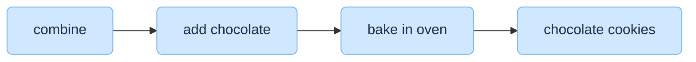
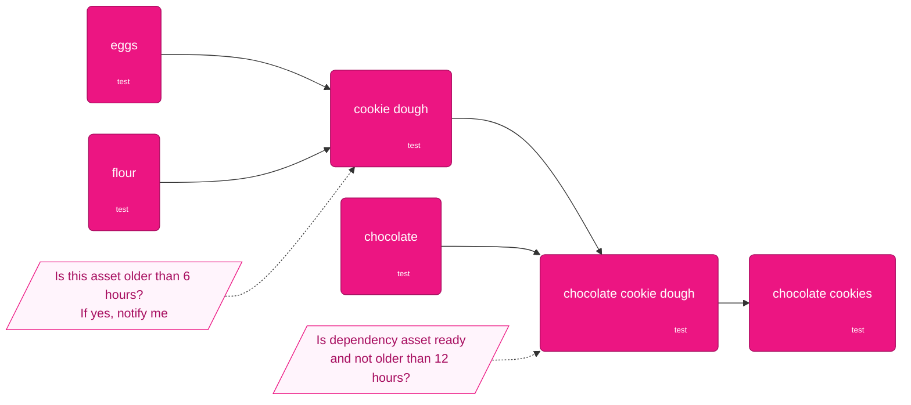

---
# You can also start simply with 'default'
theme: default
# random image from a curated Unsplash collection by Anthony
# like them? see https://unsplash.com/collections/94734566/slidev
background: https://cover.sli.dev
# some information about your slides (markdown enabled)
title: Dagster + Slurm = Productive HPC
info: |
  ## Bringing modern data orchestration to supercomputers
  Make your Dagster assets run unchanged on laptops, staging clusters, and Tier‑0 HPC systems.

  Learn more at [dagster-slurm](https://github.com/ascii-supply-networks/dagster-slurm/)
# apply unocss classes to the current slide
class: text-center
# https://sli.dev/features/drawing
drawings:
  persist: false
# slide transition: https://sli.dev/guide/animations.html#slide-transitions
transition: slide-left
# enable MDC Syntax: https://sli.dev/features/mdc
mdc: true
# open graph
seoMeta:
  # By default, Slidev will use ./og-image.png if it exists,
  # or generate one from the first slide if not found.
  ogImage: auto
  # ogImage: https://cover.sli.dev

# router mode for vue-router, can be "history" or "hash"
routerMode: hash
---

# Dagster + Slurm = Productive HPC

<div @click="$slidev.nav.next" class="mt-12 py-1" hover:bg="white op-10">
bridge the gap between orchestration and HPC schedulers <carbon:arrow-right />
</div>


<div class="abs-br m-6 text-xl">
  <button @click="$slidev.nav.openInEditor()" title="Open in Editor" class="slidev-icon-btn">
    <carbon:edit />
  </button>
  <a href="https://github.com/ascii-supply-networks/dagster-slurm/" target="_blank" class="slidev-icon-btn">
    <carbon:logo-github />
  </a>
</div>

<!--
The last comment block of each slide will be treated as slide notes. It will be visible and editable in Presenter Mode along with the slide. [Read more in the docs](https://sli.dev/guide/syntax.html#notes)
-->

---
transition: slide-up
level: 2
class: bg-white text-black
---


---
transition: slide-left
---

# The gap today

- HPC users juggle Slurm scripts, modules, and long queues with limited observability.
- Modern data teams enjoy polyglot orchestrators and fast iteration and observability but lack dedicated HPC cluster integration.
- Moving the same asset from laptop prototyping → supercomputer often means rewriting

<br>

> We set out to keep **Dagster’s developer experience** while honouring **Slurm’s HPC scheduling model**.

---
transition: fade-out
class: bg-white text-black
---

<div class="-mt-22">

</div>
<!--
From the (public) cloud we expect so much more.
-->


---
#title: More than a single engine
layout: image-right
image: /img/engine-only.jpeg
backgroundSize: contain
transition: fade-out
---

# Why orchestration matters

- A raw “engine” (script, notebook, or binary) is not enough once you depend on sensors, ETL, or ML training.
- Orchestrators provide dependency tracking, retries, metrics, and the control plane HPC teams lack.
- Dagster supplies that missing layer; dagster-slurm connects it to the supercomputer’s scheduler.


---
transition: slide-left
layout: intro
---


# What is a data orchestrator?

- 🧑‍💻 **Task Scheduling**: Determine the correct execution order of tasks
- **Resource Management**: Manage the allocation and utilization of computing resources
- **Observability**: Provide visibility into the status and performance of workflows, allowing users to track progress and troubleshoot issues - ideally as a single pane of glass
- 🛠 **Integration**: Facilitate communication and data exchange between different systems and services, enabling a cohesive workflow
- **Developer experience**: They should offer multiple modes of execution - small and big

<!--
You can have `style` tag in markdown to override the style for the current page.
Learn more: https://sli.dev/features/slide-scope-style
-->

<style>
h1 {
  background-color: #2B90B6;
  background-image: linear-gradient(45deg, #4EC5D4 10%, #146b8c 20%);
  background-size: 100%;
  -webkit-background-clip: text;
  -moz-background-clip: text;
  -webkit-text-fill-color: transparent;
  -moz-text-fill-color: transparent;
}
</style>

<!--
Here is another comment.
-->

---
transition: fade-out
# layout: two-cols
layout: image-right
image: /img/lineage-dark2.png
---

# Dagster asset graph


- Like a calculator for crunching numbers
- Graph allows computer to reason about data dependencies
- Rapid iteration: Just edit code. No need to wait for XYZ SaaS service
- Break down tool and department silos

```python {3-5|7|all}
import dagster as dg

@dg.asset
def hello(context: dg.AssetExecutionContext):
    context.log.info("Hello!")

@dg.asset(deps=[hello])
def world(context: dg.AssetExecutionContext):
    context.log.info("World!")
```

---
transition: slide-up
level: 2
---

## Task-based orchestrator


<v-click>

## Asset-based orchestration


</v-click>

<!--
Advantages of asset-based orchestration:
- Asset testing
- Asset freshness 
- Asset dependecy graph with granular declarative scheduling approach

-->

---
transition: slide-left
layout: intro
---

# What is a supercomputer?

- **Parallel Processing**: Use multiple nodes to perform calculations simultaneously, significantly reducing the time required for complex tasks.
- **High-Speed Interconnects**: Fast networking technologies to enable efficient communication between nodes.
- **Large Memory Capacity**: Substantial amounts of RAM to handle large datasets and memory-intensive applications.
- **Specialized Software**: Run specialized software and libraries optimized for parallel processing and high-performance computing.

<!--
You can have `style` tag in markdown to override the style for the current page.
Learn more: https://sli.dev/features/slide-scope-style
-->

<style>
h1 {
  background-color: #2B90B6;
  background-image: linear-gradient(45deg, #4EC5D4 10%, #146b8c 20%);
  background-size: 100%;
  -webkit-background-clip: text;
  -moz-background-clip: text;
  -webkit-text-fill-color: transparent;
  -moz-text-fill-color: transparent;
}
</style>

<!--
Here is another comment.
-->

---
transition: fade-out
layout: statement
---

# A supercomputer that few can use is just an expensive heater.

status quo

<!--
- Hard to use
- Waiting for queue submission
- Non-standard Interfaces
-->


---
transition: fade-out
layout: intro
---

# Developer productivity

- Rapid exploration locally; flip configuration to land on Slurm without code edits.
- Maintainability: autoformatting, linting, testing, and reproducible pixi environments baked in.
- Observability: Dagster UI becomes the single pane of glass for HPC and non-HPC logs.
- Structured metrics from Slurm (memory, CPUs, wall time) stream back alongside Dagster events.

<style>
h1 {
  background-color: #2B90B6;
  background-image: linear-gradient(45deg, #4EC5D4 10%, #146b8c 20%);
  background-size: 100%;
  -webkit-background-clip: text;
  -moz-background-clip: text;
  -webkit-text-fill-color: transparent;
  -moz-text-fill-color: transparent;
}
</style>

---
transition: fade
layout: two-cols
class: bg-gray-900 text-white
---

# dagster-slurm

- **Same assets everywhere** — flip `ExecutionMode` to target laptops or Slurm with identical code.
- **Deterministic runtime packaging** — pixi/pixi-pack capture dependencies, ship them to the HPC edge, and install in place.
- **Launch orchestration** — Dagster submits jobs, watches queue state, and reconciles completions via Slurm.
- **Unified observability** — Slurm telemetry, Ray logs, and Pipes stdout land in the Dagster UI for one shared console.

::right::


---
transition: fade
#layout: two-cols
#class: bg-slate-950 text-white
---

# What Dagster handles

**Under the hood**
- Packages environments with pixi/pixi-pack and syncs them to the cluster.
- Verifies the exact dependency set before booting workloads.
- Submits, monitors, and tears down Slurm jobs on your behalf.

**Developer experience**
- Switch between local and HPC by editing configuration, not code.
- Follow logs and Ray/Slurm telemetry from a single Dagster UI.
- Capture memory/CPU metrics and run metadata in a structured timeline.

<!-- ::right::
 -->

---
transition: fade
---

# Minimal workflow demo

```bash
git clone https://github.com/ascii-supply-networks/dagster-slurm.git
cd dagster-slurm
docker compose up -d --build    # spins up Slurm edge + compute nodes
```
Develop locally
```bash
cd examples
pixi run start             # Dagster UI on http://localhost:3000
```
Submit through Slurm
```bash
pixi run start-staging     # same assets, now via sbatch
pixi run start-staging-supercomputer # use real HPC cluster
```


---
transition: slide-left
layout: center
---

# Asset code stays the same

```python
import dagster as dg
from dagster_slurm import ComputeResource, RayLauncher

@dg.asset
def training_job(context: dg.AssetExecutionContext, compute: ComputeResource):
    payload = dg.file_relative_path(__file__, "../workloads/train.py")

    completed = compute.run(
        context=context,
        payload_path=payload,
        launcher=RayLauncher(num_gpus_per_node=2),
        resource_requirements={"framework": "ray", "cpus": 32, "gpus": 2, "memory_gb": 120},
        extra_env={"EXP_NAME": context.run.run_id},
    )
    yield from completed.get_results()
```


---
transition: slide-up
level: 2
# class: bg-white text-black
---


# Architecture in detail


---
transition: slide-up
level: 2
class: bg-white text-black
---


# Execution modes


---
transition: fade-out
layout: image-right
image: /img/Paxton_Wand_FINAL-2.png
backgroundSize: contain
---

# Dependency handling

- conda support is a must
- conda itself is slow and dated (even with mamba)

`pixi` as the solution

- fast
- lockfiles
- multi-environment handling (dev, prod)
- pip and conda support
- neatly packaging of environments
- easy bootstrap
- task runner

---
transition: fade-out
class: bg-white text-black

---

# Dagster Pipes

<div class="grid place-items-center h-full">

</div>

---
transition: fade-out
class: bg-white text-black
---

# Dagster Pipes - Architecture

<div class="grid place-items-center h-full">

</div>


---
layout: statement
---
# An EU sovereign GPU cloud does not come out of nowhere
maybe this project can support making HPC systems more accessible