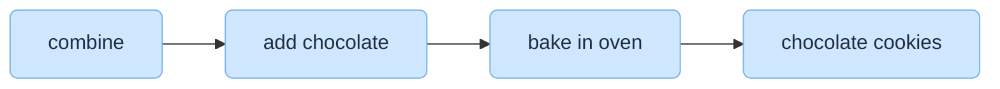
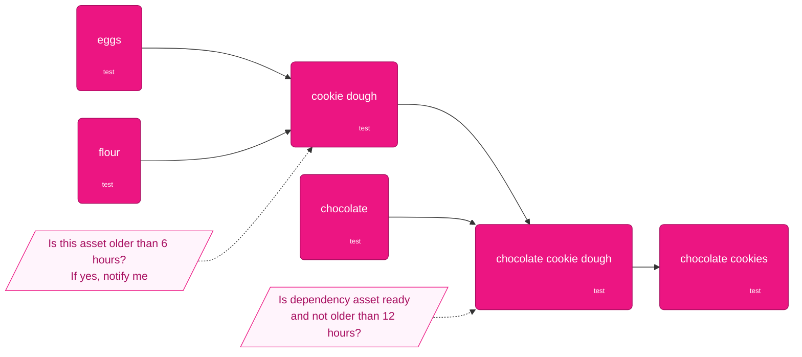

---
# You can also start simply with 'default'
theme: default
# random image from a curated Unsplash collection by Anthony
# like them? see https://unsplash.com/collections/94734566/slidev
background: https://cover.sli.dev
# some information about your slides (markdown enabled)
title: Dagster + Slurm = Productive HPC
info: |
  ## Bringing modern data orchestration to supercomputers
  Make your Dagster assets run unchanged on laptops, staging clusters, and Tier‑0 HPC systems.

  Learn more at [dagster-slurm](https://github.com/ascii-supply-networks/dagster-slurm/)
# apply unocss classes to the current slide
class: text-center
# https://sli.dev/features/drawing
drawings:
  persist: false
# slide transition: https://sli.dev/guide/animations.html#slide-transitions
transition: slide-left
# enable MDC Syntax: https://sli.dev/features/mdc
mdc: true
# open graph
seoMeta:
  # By default, Slidev will use ./og-image.png if it exists,
  # or generate one from the first slide if not found.
  ogImage: auto
  # ogImage: https://cover.sli.dev

# router mode for vue-router, can be "history" or "hash"
routerMode: hash
---

# Dagster + Slurm 
## = Productive HPC

<div @click="$slidev.nav.next" class="mt-12 py-1" hover:bg="white op-10">
bridge the gap between orchestration and HPC schedulers <carbon:arrow-right />
</div>


<div class="abs-br m-6 text-xl">
  <button @click="$slidev.nav.openInEditor()" title="Open in Editor" class="slidev-icon-btn">
    <carbon:edit />
  </button>
  <a href="https://github.com/ascii-supply-networks/dagster-slurm/" target="_blank" class="slidev-icon-btn">
    <carbon:logo-github />
  </a>
</div>

<!--
The last comment block of each slide will be treated as slide notes. It will be visible and editable in Presenter Mode along with the slide. [Read more in the docs](https://sli.dev/guide/syntax.html#notes)
-->

---
transition: slide-up
level: 2
class: bg-white text-black
---


---
transition: slide-left
---

# The gap today

- HPC users juggle Slurm scripts, modules, and long queues with limited observability.
- Modern data teams enjoy polyglot orchestrators and fast iteration and observability but lack dedicated HPC cluster integration.
- Moving the same asset from laptop prototyping → supercomputer often means rewriting

<br>

> We set out to keep **Dagster’s developer experience** while honouring **Slurm’s HPC scheduling model**.

---
transition: fade-out
class: bg-white text-black
disabled: true
---

<div class="-mt-22">

</div>
<!--
From the (public) cloud we expect so much more.
-->


---
#title: More than a single engine
layout: image-right
image: /img/engine-only.jpeg
backgroundSize: contain
transition: fade-out
---

# Why orchestration matters

- A raw “engine” (script, notebook, or binary) is not enough once you depend on sensors, ETL, or ML training.
- Orchestrators provide dependency tracking, retries, metrics, and the control plane HPC teams lack.
- Dagster supplies that missing layer; dagster-slurm connects it to the supercomputer’s scheduler.


---
transition: slide-left
layout: intro
---


# What is a data orchestrator?

- 🧑‍💻 **Workflow coordination**: Express dependencies, priorities, and retries across many jobs—not just one queue submission.
- **Resource abstraction**: Bind the same code to laptops, clouds, or supercomputers via configuration, not rewrites.
- **Observability**: Provide visibility into the status and performance of workflows, allowing users to track progress and troubleshoot issues from a single pane of glass.
- 🛠 **Integration**: Facilitate communication and data exchange between different systems and services, enabling a cohesive workflow.
- **Developer experience**: Offer fast local loops plus production parity so teams can move quickly without breaking rigor.

<!--
You can have `style` tag in markdown to override the style for the current page.
Learn more: https://sli.dev/features/slide-scope-style
-->

<style>
h1 {
  background-color: #2B90B6;
  background-image: linear-gradient(45deg, #4EC5D4 10%, #146b8c 20%);
  background-size: 100%;
  -webkit-background-clip: text;
  -moz-background-clip: text;
  -webkit-text-fill-color: transparent;
  -moz-text-fill-color: transparent;
}
</style>

<!--
Here is another comment.
-->

---
transition: fade-out
# layout: two-cols
layout: image-right
image: /img/lineage-dark2.png
---

# Dagster asset graph


- Like a calculator for crunching numbers
- Graph allows computer to reason about data dependencies
- Rapid iteration: Just edit code. No need to wait for XYZ SaaS service
- Break down tool and department silos
- Assets know when upstream data changed and re-materialise only when stale.


```python {3-5|7|all}
import dagster as dg

@dg.asset
def hello(context: dg.AssetExecutionContext):
    context.log.info("Hello!")

@dg.asset(deps=[hello])
def world(context: dg.AssetExecutionContext):
    context.log.info("World!")
```

---
transition: slide-up
level: 2
---

## Task-based orchestrator


<v-click>

## Asset-based orchestration


</v-click>

<!--
Advantages of asset-based orchestration:
- Asset testing
- Asset freshness 
- Asset dependecy graph with granular declarative scheduling approach

-->

---
transition: fade
---

# Minimal workflow demo

```bash
git clone https://github.com/ascii-supply-networks/dagster-slurm.git
cd dagster-slurm
```
Develop locally
```bash
cd examples
pixi run start             # Dagster UI on http://localhost:3000
```
Submit through Slurm
```bash
pixi run start-staging-supercomputer # use real HPC cluster, interactive enviroment bootstrap
pixi run start-production-supercomputer # pre-deployed environment, faster startup
```

---
transition: slide-left
layout: center
---

# Asset code stays the same

- Same Dagster asset runs locally or on Slurm; only configuration changes.
- Compute resource wraps payload execution with observability and retries.

```python
import dagster as dg
from dagster_slurm import BashLauncher, ComputeResource

@dg.asset
def train_pytorch(context: dg.AssetExecutionContext, compute: ComputeResource):
    script_path = dg.file_relative_path(
        __file__, "../workloads/pytorch/train_classifier.py"
    )

    completed = compute.run(
        context=context,
        payload_path=script_path,
        launcher=BashLauncher(),
        extra_env={"EPOCHS": "3", "BATCH_SIZE": "128"},
    )
    yield from completed.get_results()
```

---
transition: slide-left
layout: intro
---

# What is a supercomputer?

- **Parallel Processing**: Use multiple nodes to perform calculations simultaneously, significantly reducing the time required for complex tasks.
- **High-Speed Interconnects**: Fast networking technologies to enable efficient communication between nodes.
- **Large Memory Capacity**: Substantial amounts of RAM to handle large datasets and memory-intensive applications.
- **Specialized Software**: Run specialized software and libraries optimized for parallel processing and high-performance computing.

<!--
You can have `style` tag in markdown to override the style for the current page.
Learn more: https://sli.dev/features/slide-scope-style
-->

<style>
h1 {
  background-color: #2B90B6;
  background-image: linear-gradient(45deg, #4EC5D4 10%, #146b8c 20%);
  background-size: 100%;
  -webkit-background-clip: text;
  -moz-background-clip: text;
  -webkit-text-fill-color: transparent;
  -moz-text-fill-color: transparent;
}
</style>

<!--
Here is another comment.
-->

---
transition: fade-out
layout: statement
---

# A supercomputer that few can use is just an expensive heater.

status quo

<!--
- Hard to use
- Waiting for queue submission
- Non-standard Interfaces
-->

---
transition: fade
layout: default
---

# Different strengths, better together

### Data orchestrator
- Models business data products and when they need to refresh.
- Captures lineage, metadata, and failures across heterogeneous systems.
- Keeps engineers productive with local runs, tests, and incremental deploys.

### Supercomputer + Slurm
- Maximises utilisation of scarce accelerators and node hours.
- Enforces fair-share policies, job placement, and low-level resource binding.
- Provides high-performance file systems and interconnect-aware scheduling.

### Bridge
- dagster-slurm lets Dagster plan the work while Slurm owns the physical execution.


---
transition: fade-out
layout: intro
disabled: true
---

# Developer productivity

- Rapid exploration locally; flip configuration to land on Slurm without code edits.
- Maintainability: through reproducible pixi environments (lockfiles, environments).
- Observability: Dagster UI becomes the single pane of glass for HPC and non-HPC logs.
- Structured metrics from Slurm (memory, CPUs, wall time) stream back alongside Dagster events.

<style>
h1 {
  background-color: #2B90B6;
  background-image: linear-gradient(45deg, #4EC5D4 10%, #146b8c 20%);
  background-size: 100%;
  -webkit-background-clip: text;
  -moz-background-clip: text;
  -webkit-text-fill-color: transparent;
  -moz-text-fill-color: transparent;
}
</style>

---
transition: fade
layout: two-cols
---

# dagster-slurm in one slide

- **Keep the Dagster control plane** — asset logic, schedules, and policies stay in Dagster regardless of where you run.
- **Package once, run anywhere** — pixi/pixi-pack builds reproducible environments that deploy to login nodes, edge VMs, or compute partitions.
- **Delegate execution to Slurm** — dagster-slurm translates runs into `sbatch`/`squeue` interactions while respecting quotas and placement rules.
- **See everything in Dagster UI** — queue state, Slurm metrics, and Pipes logs stream back for a single operational console.

::right::


---
transition: fade
#layout: two-cols
#class: bg-slate-950 text-white
---

# What dagster-slurm handles

## Under the hood
- Packages environments with pixi/pixi-pack and syncs them to the cluster.
- Verifies the exact dependency set before booting workloads.
- Submits, monitors, and tears down Slurm jobs on your behalf.

## Developer experience
- Switch between local and HPC by editing configuration, not code.
- Follow logs and Slurm telemetry plus Pipes messages from a single pane of glass, for HPC and non-HPC workloads.
- Capture memory/CPU metrics and run metadata in a structured timeline.

<!-- ::right::
 -->


---
transition: slide-up
disabled: true
---

# Architecture in detail


---
transition: slide-up
level: 2
class: bg-white text-black
disabled: true
---


# Execution modes


---
transition: fade-out
layout: image-right
image: /img/Paxton_Wand_FINAL-2.png
backgroundSize: contain
---

# Dependency handling

- conda support is a must
- conda itself is slow and dated (even with mamba)

`pixi` as the solution

- fast
- lockfiles
- multi-environment handling (dev, prod)
- pip and conda support
- neatly packaging of environments
- easy bootstrap
- task runner
- [`pixi-pack`](https://github.com/Quantco/pixi-pack) to ship consistent environments to HPC systems

---
transition: fade-out
class: bg-white text-black

---

# Dagster Pipes

<div class="grid place-items-center h-full">

</div>

---
transition: fade-out
class: bg-white text-black
---

# Dagster Pipes - Architecture

<div class="grid place-items-center h-full">

</div>


layout: default
---

# Problems encountered

- No technical service user: 12-hour OTP tokens block continuous orchestration.
- Outbound network is closed on compute nodes, trapping larger data pulls.
- Partition-specific NUMA settings on Leonardo trigger inconsistent CPU pinning.
- Packaging GPU dependencies still requires manual alignment with site modules.

---
layout: statement
---
# EU sovereign GPU cloud does not come out of nowhere
maybe this project can support making HPC systems more accessible

dagster-slurm

---
layout: default
---

# Evolution and Strategy

> Goal: Bridge Dagster + Slurm

- Strategy: Make things work on real HPCs
- Change? Not needed; VSC, Leonardo working now.
- Learnings: Inconsistent NUMA on Leonardo, OTP hurdles

---
layout: default
---

# Results and Final Profile

- Accomplished connecting our solution to 2 real HPC systems (Leonardo, VSC5).
- This allows for a single pane of glass
- This streamlines and simplfies working with HPC systems
- Slurm in CI is possible


## Learnings
To become a viable possibility for a European GPU cloud some changes are needed:
- Authentication, techincal service users
- Netowrk access (to connect to exteral data)

---
layout: default
---

# Wishlist

### Tools
- Pre-installed pixi/pixi-pack on login nodes to speed up onboarding.
- Sample Dagster pipelines that demonstrate sanctioned Slurm patterns and dagster-slurm available

<br>

### Event
- Hackathon office hours with site operators to fast-track credential tweaks.

<br>

### Systems
- dagster-slurm shipped as a supported module once prerequisites land (technical service user)
- changed network access from all cluster nodes for accessing large external datasets.

---
layout: intro
class: bg-emerald-950 text-white
---

# Was it worth it?

- **Yes.** We now trigger the same Dagster assets locally and on Leonardo, VSC5 without code edits.
- Engineers gained observability in a shared single pane of glass instead of tailing Slurm logs per node.
- Continued development is planned

Resources necessary:
- Access to HPC system to test
- Desire of HPC operators to change systems to solve blockers (technical service user, network access)


---
layout: default
class: bg-slate-100 text-slate-900
---

# One-page summary

<div class="grid grid-cols-2 grid-rows-2 gap-4 h-[480px]">
  <div class="border border-slate-300 bg-white rounded-xl p-6 flex flex-col shadow-sm">
    <h3 class="text-xs font-semibold uppercase tracking-[0.2em] text-slate-500">Application Background</h3>
    <ul class="mt-4 space-y-2 text-base leading-relaxed">
      <li>Data orchestrators like Dagster deliver richer end-to-end observability.</li>
      <li>They integrate heterogeneous systems so data and compute stay coordinated.</li>
    </ul>
  </div>
  <div class="border border-slate-300 bg-white rounded-xl p-6 flex flex-col shadow-sm">
    <!-- <h3 class="text-xs font-semibold uppercase tracking-[0.2em] text-slate-500">System Prerequisites</h3>
    <ul class="mt-4 space-y-2 text-base leading-relaxed">
      <li>Service credentials without 12-hour OTP churn.</li>
      <li>Predictable NUMA and partition settings to avoid manual overrides.</li>
      <li>Flexible data ingress so large external assets like commoncrawl can be analyzed on HPC systems</li>
    </ul> -->
    
  </div>
  <div class="border border-slate-300 bg-white rounded-xl p-6 flex flex-col shadow-sm">
    <h3 class="text-xs font-semibold uppercase tracking-[0.2em] text-slate-500">Hackathon Objectives</h3>
    <ul class="mt-4 space-y-2 text-base leading-relaxed">
      <li>Integrate Dagster orchestration with real HPC clusters</li>
      <li>Make Leonardo and VSC5 work</li>
    </ul>
  </div>
  <div class="border border-slate-300 bg-white rounded-xl p-6 flex flex-col shadow-sm">
    <h3 class="text-xs font-semibold uppercase tracking-[0.2em] text-slate-500">Technical Accomplishment</h3>
    <ul class="mt-4 space-y-2 text-base leading-relaxed">
      <li>Integration accomplished for Leonardo, VSC5</li>
      <li>SLURM in CI</li>
    </ul>
  </div>
</div>

---
layout: center
class: bg-white text-black
---

# 100-word summary

Dagster-slurm lets us treat Leonardo or VSC5 like any other deployment target: assets defined once now flip from local development to Slurm without code changes. Pixi-pack seals Python environments so the same build runs on laptops, and real HPC clusters. 

Dagster Pipes streams metrics, queue state, and structured logs back into a single pane of glass, giving data scientists and HPC operators shared observability. 

We surfaced blockers—short-lived OTP credentials, closed outbound networking, and inconsistent NUMA defaults—and captured concrete asks for admins.

> The effort validates that orchestrator-based ergonomics and supercomputer horsepower can finally coexist.


---
layout: default
---

# Acknowledgements

The EUROCC AI Hackathon
https://www.openhackathons.org/s/siteevent/a0CUP000013Tp8f2AC/se000375

We thank the operations teams at the Austrian Scientific Computing (ASC) (VSC-5) and CINECA’s Leonardo supercomputer for early feedback, and the Dagster community for discussions around orchestrating HPC workloads. Funding and in-kind support were provided by the Complexity Science Hub Vienna and the Austrian Supply Chain Intelligence Institute.
We furhter thank the EUROCC AI HACKATHON 2025 for providing the opportunity to test and validate our work in a real HPC environment. 


